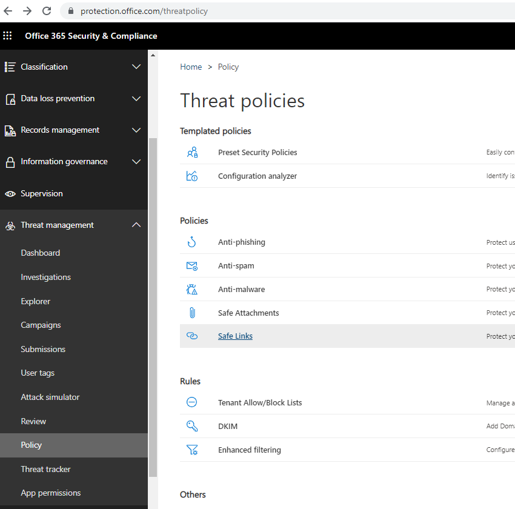
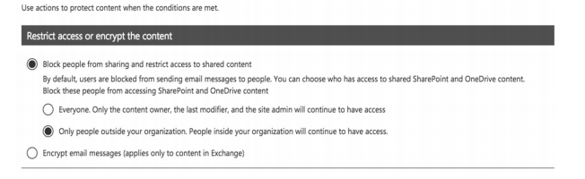

#### __pag 9. QUESTION 14__

Your company has a Microsoft 365 E5 subscription.

Users in the research department work with sensitive data.  
You need to prevent the research department users from accessing potentially __unsafe websites by using
hyperlinks embedded in email messages and documents__. __Users in other departments must not be
restricted__.  

What should you do from the Security & Compliance admin center?  
A. Create a data loss prevention (DLP) policy that has a Content is shared condition.  
B. Modify the default safe links policy.  
C. Create a data loss prevention (DLP) policy that has a Content contains condition.  
D. Create a new safe links policy.  

__Correct Answer: D__

https://docs.microsoft.com/en-us/office365/securitycompliance/set-up-atp-safe-links-policies#policies-thatapply-to-specific-email-recipients

---

#### __pag 29. QUESTION 17__

You have a Microsoft 365 subscription.  
You need to be notified if users receive email containing a file that has a virus.  
What should you do?  
A. From the Exchange admin center, create an in-place eDiscovery & hold.  
B. From the Security & Compliance admin center, create a safe attachments policy.  
C. From the Security & Compliance admin center, create a data loss prevention (DLP) policy.  
D. From the Security & Compliance admin center, create an alert policy.  

__Correct Answer: D__

https://docs.microsoft.com/en-us/microsoft-365/compliance/alert-policies?view=o365-worldwide

PENDIENTE DE VER ALERTAS

---

#### __pag 40. QUESTION 14__

In Microsoft 365, you configure a data loss prevention (DLP) policy named Policy1. Policy1 detects the
sharing of United States (US) bank account numbers in email messages and attachments.
Policy1 is configured as shown in the exhibit. (Click the Exhibit tab.)

You need to ensure that internal users can email documents that contain US bank account numbers to
external users who have an email suffix of contoso.com.  
What should you configure?  
A. an exception  
B. an action  
C. a condition  
D. a group  

__Correct Answer: B__

https://docs.microsoft.com/en-us/office365/securitycompliance/data-loss-prevention-policies#how-dlppolicies-work

---

#### __pag 42. QUESTION 14__

You have a Microsoft 365 subscription.  
From the Security & Compliance admin center, you create a role group named US eDiscovery Managers by
copying the eDiscovery Manager role group.  
You need to ensure that the users in the new role group can only perform content searches of mailbox
content for users in the United States.  
Solution: From the Security & Compliance admin center, you modify the roles of the US eDiscovery
Managers role group  

Does this meet the goal?
A. Yes
B. No
Correct Answer: __B__

---

#### __pag 46. QUESTION 24__

You have a Microsoft 365 subscription.  
Some users have iPads that are managed by your company.  
You plan to prevent the iPad users from copying corporate data in Microsoft Word and pasting the data into
other applications.  
What should you create?  
A. A conditional access policy.  
B. A compliance policy.  
C. An app protection policy.  
D. An app configuration policy.  

Correct Answer: __C__

https://docs.microsoft.com/en-us/intune/app-protection-policy

---

#### __pag 33. QUESTION 2__

 
Your company has a Microsoft 365 subscription.  
You need to identify which users performed the following privileged administration tasks:  
- Deleted a folder from the second-stage Recycle Bin of Microsoft SharePoint  
- Opened a mailbox of which the user was not the owner  
- Reset a user password  

What should you use?  

A. Microsoft Azure Activity Directory (Azure AD) audit logs
B. Security & Compliance content search
C. Microsoft Azure Activity Directory (Azure AD) sign-ins
D. Security & Compliance audit log search

Correct Answer: __A__

References:
https://docs.microsoft.com/en-us/azure/azure-monitor/platform/activity-logs-overview

---

#### __pag 48. QUESTION 28__

 
You create a new Microsoft 365 subscription and assign Microsoft 365 E3 licenses to 100 users.  
From the Security & Compliance admin center, you enable auditing.  
You are planning the auditing strategy.  
Which three activities will be audited by default? Each correct answer presents a complete solution.  
NOTE: Each correct selection is worth one point.  

A. An administrator creates a new Microsoft SharePoint site collection.  
B. An administrator creates a new mail flow rule.  
C. A user shares a Microsoft SharePoint folder with an external user.  
D. A user delegates permissions to their mailbox.  
E. A user purges messages from their mailbox.  

Correct Answer: __ABC__
 
https://docs.microsoft.com/en-us/office365/securitycompliance/search-the-audit-log-in-security-and-compliance?redirectSourcePath=%252farticle%252f0d4d0f35-390b-4518-800e-0c7ec95e946c

