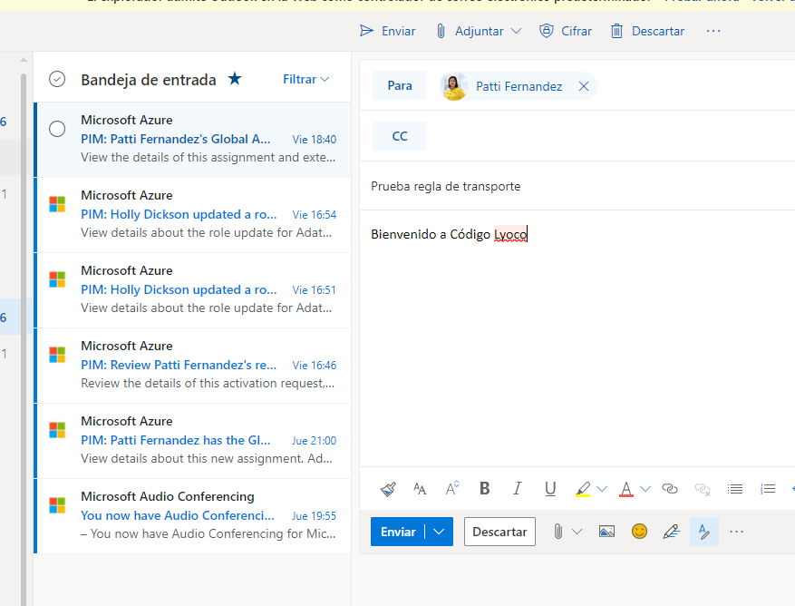

#### Mail Flow Rule

---

- 1 desde Exchange admin center. creamos una nueva regla de flujo

- 2  de entre todas las posibilidades selecccionamos que el asunto o el cuerpo del mensaje contenga una palabra por ejemplo Lyoco

 

- 3  y como accion que lo rechace informando como texto "confidencial"

 

- 4  Pdemos ver su funcionamineto

 

 

